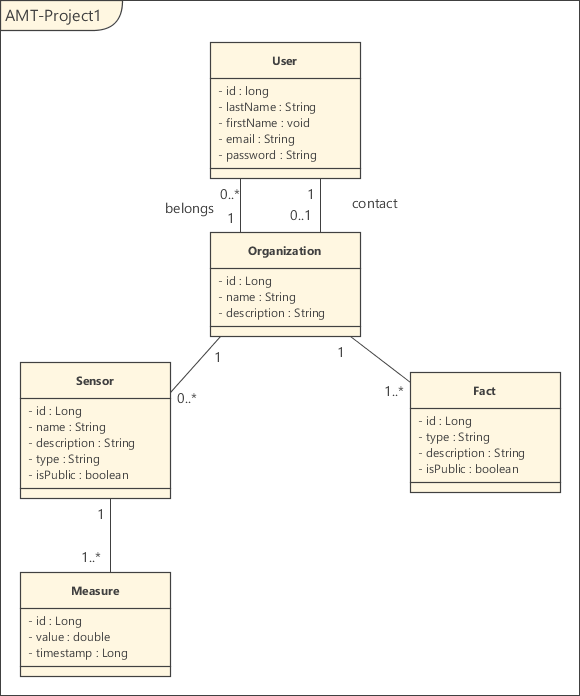

This project implements a REST API for our AMT project ([Teaching-HEIGVD-AMT][github]). 

[github]: https://github.com/wasadigi/Teaching-HEIGVD-AMT/tree/master/lectures/lecture-07

## About
This project is about organizations wich own sensors, and get measures from these sensors.
The users are associated to an organization, and an organization can create facts about the measures of sensors.

## Domain modeling

